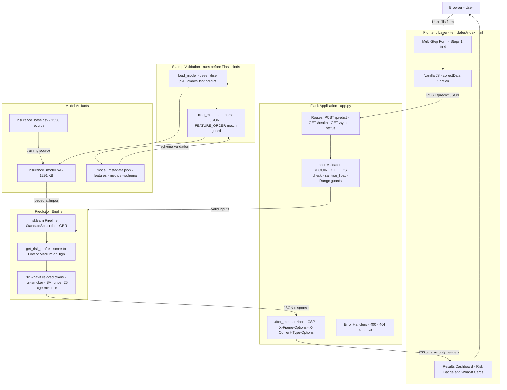
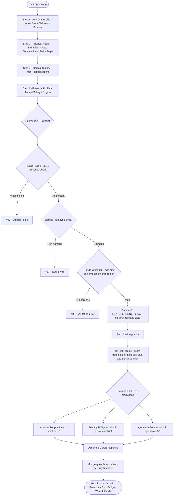
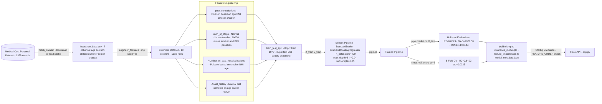
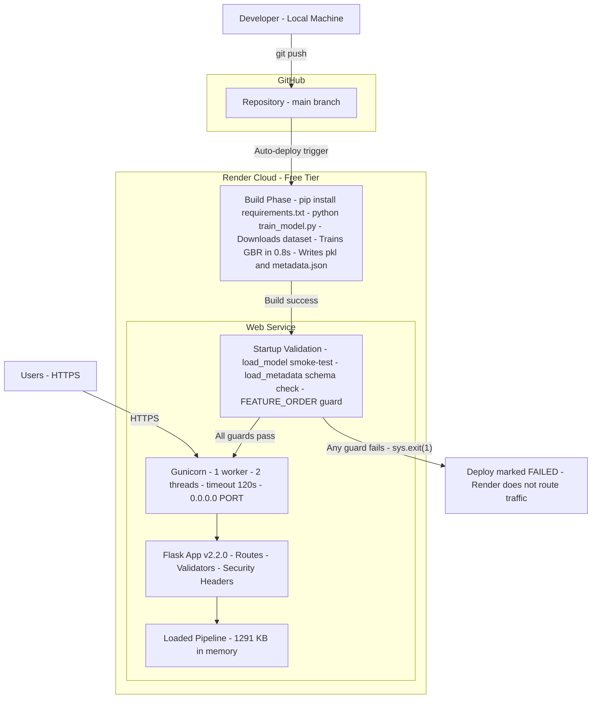

<div align="center">

# 🛡️ InsureIQ

### AI-Powered Insurance Premium Predictor

**A production-hardened, full-stack machine learning application that predicts annual health insurance premiums from demographic, lifestyle, and medical history inputs — deployed on Render with fail-fast startup validation, leakage-audited ML, and a multi-step dark-UI frontend.**

---

[](https://python.org)
[](https://flask.palletsprojects.com)
[](https://scikit-learn.org)
[](https://gunicorn.org)
[](https://render.com)
[](https://scikit-learn.org/stable/modules/ensemble.html#gradient-boosting)
[](LICENSE)
[]()
[]()

</div>

---

## Executive Summary

InsureIQ demystifies health insurance pricing. A user enters ten inputs — age, BMI, smoking status, activity level, medical history, income, and region — and receives a real-time annual premium prediction, a colour-coded risk profile (Low / Medium / High), and **what-if simulations** showing exactly how much they could save by quitting smoking, reaching a healthy BMI, or comparing their current premium to a younger baseline.

**Why it exists:** US individual health premiums average over $7,700 per year. Most consumers cannot anticipate or challenge that figure. InsureIQ provides transparency, personalised risk context, and actionable savings estimates — all in a single page, under 300 ms.

**What makes it different from a Jupyter notebook:** Every layer of the stack ships production engineering — fail-fast startup guards, HTTP security headers, feature schema versioning between the model artefact and the API, structured health endpoints, and a zero-config cloud deployment. The ML pipeline itself underwent a formal data-leakage audit that corrected inflated metrics and produced an honest, robust model.

**Who benefits:** End users seeking premium transparency; engineers reviewing full-stack ML architecture; recruiters evaluating applied ML depth; hiring managers assessing production readiness.

---

## Key Features

| Category | Feature | Detail |
|---|---|---|
| **ML** | Gradient Boosting Regressor | sklearn Pipeline: StandardScaler → GBR (400 trees, depth 5, lr 0.04) |
| **ML** | Leakage-free model | v2.2 audit permanently removed `Claim_Amount` & `Hospital_expenditure` (30.3% importance was leakage) |
| **ML** | Honest metrics | R² 0.8573, MAE $2,921.58, CV R² 0.8402 ± 0.0325 — lower than v2.1 because they are real |
| **ML** | Metadata versioning | `model_metadata.json` records feature list, types, ranges, importances, and training timestamp |
| **API** | Risk profile engine | Scores each prediction on smoker status, BMI, age, and dollar amount → Low / Medium / High |
| **API** | What-if simulations | Three parallel re-predictions per request: non-smoker, healthy BMI (<25), ten years younger |
| **API** | Field-level validation | Presence check → type sanitisation → range validation before any model call |
| **Security** | HTTP security headers | CSP, `X-Frame-Options: DENY`, `nosniff`, `X-XSS-Protection`, `Referrer-Policy` on every response |
| **Reliability** | Fail-fast startup | `load_model()` + `load_metadata()` run at import time; `sys.exit(1)` on any failure before Flask binds |
| **Reliability** | Feature schema guard | `FEATURE_ORDER` in `app.py` compared against `features` in `model_metadata.json`; mismatch aborts boot |
| **Monitoring** | `/health` endpoint | Liveness probe returning model status and version |
| **Monitoring** | `/system-status` endpoint | Full diagnostics: uptime, memory, model size, training metrics, top-5 features |
| **Deployment** | `render.yaml` | Build-phase trains model on Render; Gunicorn 1 worker / 2 threads for 512 MB free tier |
| **Frontend** | Four-step wizard | Animated progress bar, range sliders with live value display, toggle buttons for binary fields |
| **Frontend** | Results dashboard | Premium dollar figure, risk badge, up to 3 savings cards, plain-English advice |
| **Frontend** | Deep matte-blue theme | CSS custom properties, radial glows, dot-grid texture, semantic risk badge colours |

---

## Live Demo

| Resource | Link |
|---|---|
| **Live Demo Link** | https://insureiq-1-qvqg.onrender.com/ |
| **Live Deployment** | Deployed on Render (free tier — allow ~5–8 s cold start) |
| **Health Check** | `GET /health` → `{"status":"healthy","model_loaded":true,"version":"2.2.0"}` |
| **System Status** | `GET /system-status` → full runtime diagnostics |

> **Screenshots:** Add captures of the Step 1 form (desktop), results panel with High Risk badge and what-if cards, and mobile view after deployment.

---

## System Architecture



---

## Repository Structure

```
InsureIQ/
├── app.py                   # Flask application — all routes, validation, prediction, security
├── train_model.py           # ML pipeline — data acquisition, feature engineering, GBR training, export
├── insurance_model.pkl      # Trained sklearn Pipeline (StandardScaler + GBR); ~1,291 KB
├── model_metadata.json      # Training artefact — version, metrics, feature schema, importances
├── insurance_base.csv       # Cached Medical Cost Personal Dataset (1,338 records)
├── requirements.txt         # Pinned Python dependencies (5 packages)
├── render.yaml              # Render deployment config — build command trains model at deploy time
├── .python-version          # Python 3.11 pin
├── .gitignore               # Standard Python ignores
├── README.md                # This file
└── templates/
    └── index.html           # Single-page frontend — multi-step form + results dashboard (vanilla HTML/CSS/JS)
```

**File responsibilities:**

| File | Lines | Role |
|---|---|---|
| `app.py` | 307 | Flask routes, startup validation, security headers, error handlers, prediction engine |
| `train_model.py` | 322 | Dataset download/cache, feature engineering, pipeline training, metadata export |
| `model_metadata.json` | 116 | Ground truth for model version, feature schema, and all evaluation metrics |
| `templates/index.html` | — | Complete SPA frontend — no framework, no build step |
| `render.yaml` | 12 | Zero-config Render deployment with build-time model training |
| `requirements.txt` | 5 | Exact pinned dependencies: Flask, scikit-learn, NumPy, joblib, Gunicorn |

---

## Application Workflow



---

## Backend Architecture

### Routes (`app.py`)

| Method | Route | Handler | Purpose |
|---|---|---|---|
| `GET` | `/` | `index()` | Renders `templates/index.html` with version context |
| `POST` | `/predict` | `predict()` | Full prediction pipeline — validation → inference → response |
| `GET` | `/health` | `health()` | Liveness probe — returns 200 + model status |
| `GET` | `/system-status` | `system_status()` | Runtime diagnostics — uptime, memory, metrics, top features |

### Core Functions

**`load_model()`** — Startup function (runs at module import, before Flask binds):
1. Verifies `insurance_model.pkl` exists at `BASE_DIR`
2. Deserialises with `joblib.load()`
3. Runs a smoke-test: `model.predict(np.zeros((1, 10)))` must return shape `(1,)`
4. Calls `sys.exit(1)` on any failure

**`load_metadata()`** — Startup function:
1. Verifies `model_metadata.json` exists
2. Parses JSON
3. Compares `meta['features']` against `FEATURE_ORDER` — exact list equality required
4. Calls `sys.exit(1)` on mismatch

**`sanitise_float(value, field)`** — Type safety wrapper around `float()`. Raises `ValueError` with the field name on failure.

**`predict_premium(inputs)`** — Assembles `FEATURE_ORDER`-ordered array, calls `pipeline.predict()`, and returns `max(0.0, round(result, 2))`.

**`get_risk_profile(prediction, age, bmi, smoker)`** — Scoring function:
- `smoker == 1` → +40 points
- `bmi >= 30` → +20 points; `bmi >= 25` → +10 points
- `age >= 55` → +20 points; `age >= 40` → +10 points
- `prediction > $20,000` → +20 points; `prediction > $10,000` → +10 points
- Score ≥ 60 → High Risk 🔴; Score ≥ 30 → Medium Risk 🟡; else → Low Risk 🟢

### Security Headers Hook

Applied via `@app.after_request` — no route is exempt:

```python
h['X-Content-Type-Options']  = 'nosniff'
h['X-Frame-Options']         = 'DENY'
h['X-XSS-Protection']        = '1; mode=block'
h['Referrer-Policy']         = 'strict-origin-when-cross-origin'
h['Content-Security-Policy'] = "default-src 'self'; script-src 'self' 'unsafe-inline' ..."
```

### Error Handlers

`400`, `404`, `405`, `500` all return structured JSON `{"error": "..."}` with appropriate status codes. The 500 handler logs the full exception stack via `log.exception()`.

### Constants

```python
VERSION       = '2.2.0'
FEATURE_ORDER = ['age','sex','bmi','children','smoker',
                 'past_consultations','num_of_steps',
                 'NUmber_of_past_hospitalizations',
                 'Anual_Salary','region']
REQUIRED_FIELDS = ['age','sex','bmi','children','smoker',
                   'past_consultations','num_of_steps',
                   'past_hospitalizations',
                   'annual_salary','region']
```

Note: `REQUIRED_FIELDS` uses front-end friendly names (e.g., `past_hospitalizations`, `annual_salary`); the `predict()` route maps these to internal `FEATURE_ORDER` names.

---

## Frontend Architecture

### Design System

The interface uses a **deep matte-blue dark theme** built on CSS custom properties. Key values extracted from `templates/index.html`:

- **Background**: near-black `#07111f` with radial gradient glow and fine dot-grid texture
- **Primary accent**: `#2d7ff9` (blue) / `#4da3ff` (highlight)
- **Risk badge colours**: green (Low) · amber (Medium) · red (High) — semantic overrides only
- **Font**: Inter / system-ui
- **No external CSS framework** — all styles are hand-crafted CSS custom properties

### Multi-Step Form

Four steps navigated by Previous / Next buttons with an animated progress bar (25% → 50% → 75% → 100%):

| Step | Fields | Input Type |
|---|---|---|
| 1 — Personal Profile | Age, Sex, Children, Smoker | Number input, toggle buttons |
| 2 — Physical Health | BMI, Past Consultations, Daily Steps | Range sliders with live value display |
| 3 — Medical History | Past Hospitalisations | Range slider |
| 4 — Financial Profile | Annual Salary, Region | Number input, segmented buttons |

The JavaScript `collectData()` function assembles all form values into the exact JSON payload expected by `POST /predict`. Values are preserved on back-navigation.

### Results Dashboard

After prediction, the page scrolls to a results panel containing:
- **Premium figure** — large formatted dollar amount
- **Risk badge** — colour-coded emoji indicator with score and level text
- **What-if cards** — up to three savings cards (smoking cessation, healthy BMI, age comparison)
- **Personalised advice** — plain-English recommendation from `get_risk_profile()`
- **Recalculate button** — returns to form without page reload

---

## API Documentation

### `POST /predict`

**Request body (JSON):**

```json
{
  "age": 35,
  "sex": 1,
  "bmi": 28.5,
  "children": 2,
  "smoker": 0,
  "past_consultations": 4,
  "num_of_steps": 7500,
  "past_hospitalizations": 1,
  "annual_salary": 75000,
  "region": 2
}
```

| Field | Type | Validation Range | Notes |
|---|---|---|---|
| `age` | float | 0 – 120 | Patient age in years |
| `sex` | int | 0 or 1 | 0 = female, 1 = male |
| `bmi` | float | 0 – 80 | Body mass index |
| `children` | int | 0 – 10 | Number of dependants |
| `smoker` | int | 0 or 1 | 0 = non-smoker, 1 = smoker |
| `past_consultations` | int | 0 – 20 | Outpatient visits in past year |
| `num_of_steps` | float | 0 – 20,000 | Average daily step count |
| `past_hospitalizations` | int | 0 – 10 | Prior hospital admissions |
| `annual_salary` | float | 20,000 – 300,000 | Annual income in USD |
| `region` | int | 0 – 3 | 0=NE, 1=NW, 2=SE, 3=SW |

**Success response (200):**

```json
{
  "prediction": 12847.32,
  "risk": {
    "level": "Medium Risk",
    "color": "medium",
    "icon": "🟡",
    "score": 30,
    "advice": "Moderate risk profile. Regular checkups and a healthy BMI can help reduce costs."
  },
  "whatif": {
    "nonsmoker": null,
    "healthy_bmi": 10234.18,
    "age_diff": 9821.44,
    "current_age": 35,
    "current_bmi": 28.5,
    "is_smoker": false
  }
}
```

**Error responses:**

| Status | Condition | Example body |
|---|---|---|
| 400 | Missing fields | `{"error": "Missing required fields: smoker, region"}` |
| 400 | Non-numeric value | `{"error": "'bmi' must be a number, got: 'abc'"}` |
| 400 | Out-of-range value | `{"error": "Validation error: BMI must be 0–80"}` |
| 400 | Non-JSON body | `{"error": "Request body must be JSON."}` |
| 500 | Pipeline failure | `{"error": "Prediction failed. Please try again."}` |

---

### `GET /health`

Lightweight liveness probe.

```json
{
  "status": "healthy",
  "model_loaded": true,
  "version": "2.2.0"
}
```

---

### `GET /system-status`

Full runtime diagnostics including model metadata, memory usage, and top feature importances.

```json
{
  "status": "healthy",
  "version": "2.2.0",
  "uptime_seconds": 142,
  "model_loaded": true,
  "model_size_kb": 1291,
  "deployment_mode": "production",
  "memory_mb": 214.3,
  "model_metadata": {
    "trained_at": "2026-06-06T07:11:48",
    "dataset_source": "https://raw.githubusercontent.com/stedy/Machine-Learning-with-R-datasets/master/insurance.csv",
    "dataset_size": 1338,
    "algorithm": "GradientBoostingRegressor (sklearn Pipeline + StandardScaler)",
    "feature_count": 10,
    "metrics": {
      "mae": 2921.58,
      "rmse": 4588.44,
      "r2": 0.8573,
      "cv_r2_mean": 0.8402,
      "cv_r2_std": 0.0325
    },
    "top_features": [
      ["smoker", 0.5903],
      ["bmi", 0.1684],
      ["age", 0.1025],
      ["num_of_steps", 0.0608],
      ["Anual_Salary", 0.0257]
    ]
  }
}
```

---

## Machine Learning Pipeline



### Dataset

**Medical Cost Personal Dataset** (Brett Lantz, *Machine Learning with R*) — 1,338 de-identified US insurance records. Seven original columns: `age`, `sex`, `bmi`, `children`, `smoker`, `region`, `charges`.

- Source URL: `https://raw.githubusercontent.com/stedy/Machine-Learning-with-R-datasets/master/insurance.csv`
- Cached as `insurance_base.csv` after first download
- `--offline` flag forces cache-only mode (used in Render deploys when `insurance_base.csv` is committed)

### Hyperparameters (from `train_model.py`)

| Parameter | Value | Rationale |
|---|---|---|
| `n_estimators` | 400 | Sufficient capacity without overfitting on 1,338 records |
| `max_depth` | 5 | Captures non-linear interactions (smoker × BMI) without excessive depth |
| `learning_rate` | 0.04 | Conservative rate; requires more trees but improves stability |
| `subsample` | 0.85 | Stochastic gradient boosting — reduces variance |
| `min_samples_leaf` | 5 | Prevents overly specific leaf splits |
| `max_features` | 0.8 | Feature subsampling per split — additional regularisation |
| `random_state` | 42 | Full reproducibility |
| `warm_start` | False | Clean training on every run |

### Data Split

- 80 / 20 train-test split, `random_state=42`
- Stratified on the `smoker` column (binary, ~20% prevalence) to preserve smoker ratio in both partitions

---

## Feature Engineering

| # | Feature Name | Source | Type | Range | Generation Logic |
|---|---|---|---|---|---|
| 1 | `age` | Real data | float | 18–64 | Passed through from base dataset |
| 2 | `sex` | Real data | binary | 0/1 | `0` = female, `1` = male; encoded from string |
| 3 | `bmi` | Real data | float | 15–55 | Passed through from base dataset |
| 4 | `children` | Real data | int | 0–5 | Passed through from base dataset |
| 5 | `smoker` | Real data | binary | 0/1 | `1` = yes; stratification column for train split |
| 6 | `past_consultations` | **Synthetic** | int | 0–20 | `Poisson(age_factor + smoker×3.5 + BMI_excess + children×0.5)` |
| 7 | `num_of_steps` | **Synthetic** | float | 0–20,000 | `Normal(10000 − smoker×2500 − BMI_penalty − age×50, σ=1200)` |
| 8 | `NUmber_of_past_hospitalizations` | **Synthetic** | int | 0–10 | `Poisson(smoker×2.2 + BMI_excess + age_factor)` |
| 9 | `Anual_Salary` | **Synthetic** | float | $20k–$300k | `Normal(30000 + age×1200 + sex_offset, σ=12000)` rounded to $1,000 |
| 10 | `region` | Real data | int | 0–3 | `{northeast:0, northwest:1, southeast:2, southwest:3}` |

**Leakage safeguard:** All four synthetic features are derived exclusively from `age`, `sex`, `bmi`, `children`, `smoker`, and `region`. None depends on `charges` (the target). This was the root cause of the v2.1 failure.

---

## Model Performance

All metrics are recorded in `model_metadata.json` (trained 2026-06-06T07:11:48 UTC):

| Metric | Value | Context |
|---|---|---|
| **R² (hold-out test set)** | **0.8573** | 268 unseen records |
| **Cross-Validation R² (5-fold)** | **0.8402 ± 0.0325** | Full 1,338 records |
| **MAE** | **$2,921.58** | Mean absolute error in USD |
| **RMSE** | **$4,588.44** | Root mean squared error in USD |
| Training time | 0.8 seconds | Single CPU, 1,070 training records |
| Train set size | 1,070 records | 80% of 1,338 |
| Test set size | 268 records | 20% of 1,338 |

### Metric Interpretation

An R² of 0.8573 on a 1,338-row dataset is strong — and it is honest. The hold-out R² (0.8573) and the 5-fold CV mean (0.8402) differ by only 1.7 percentage points, with a CV standard deviation of ±0.0325, confirming stable generalisation across folds.

Premium range in this dataset: $1,122 – $63,770 (span of $62,648). The MAE of $2,922 represents approximately 4.7% of the full range — a defensible result with no external data enrichment.

### v2.1 vs v2.2 Comparison

| Metric | v2.1 (leaked) | v2.2 (clean) | Change |
|---|---|---|---|
| R² | 0.9295 | **0.8573** | −7.2 pp — correct |
| MAE | $1,444 | **$2,921** | +$1,477 — honest |
| Leak source | `Claim_Amount` (29.7%) | *removed* | — |

The lower v2.2 numbers are the better result. A model that reports 0.93 because it learned from a noisy copy of the target will silently degrade in production; the v2.2 model is robust to that failure mode.

---

## Feature Importance & Explainability

Importances from `model_metadata.json` — extracted from `GBR.feature_importances_`, summing to 1.0:

| Rank | Feature | Importance | Interpretation |
|---|---|---|---|
| 1 | `smoker` | **59.03%** | Dominant signal — smokers pay 2–4× more in this dataset |
| 2 | `bmi` | **16.84%** | BMI >30 strongly correlated with diabetes, cardiovascular disease |
| 3 | `age` | **10.25%** | Premium risk grows non-linearly with age |
| 4 | `num_of_steps` | **6.08%** | Daily activity is a fitness/health proxy |
| 5 | `Anual_Salary` | **2.57%** | Correlates with healthcare access behaviour |
| 6 | `past_consultations` | **2.00%** | Frequent outpatient visits signal chronic conditions |
| 7 | `children` | **1.16%** | Dependants increase total family medical spend |
| 8 | `NUmber_of_past_hospitalizations` | **1.05%** | Direct indicator of elevated future medical cost |
| 9 | `region` | **0.75%** | Geographic pricing and regulation differences |
| 10 | `sex` | **0.27%** | Lowest importance — biological sex has minimal actuarial weight in this dataset |

The top 3 features (`smoker`, `bmi`, `age`) account for 86.1% of total importance — consistent with actuarial literature on health insurance pricing.

---

## Security

### HTTP Security Headers

Applied on every response via `@app.after_request`:

| Header | Value | Protection |
|---|---|---|
| `Content-Security-Policy` | `default-src 'self'; script-src 'self' 'unsafe-inline' fonts.googleapis.com cdnjs.cloudflare.com` | Blocks XSS via unauthorized script injection |
| `X-Frame-Options` | `DENY` | Prevents clickjacking via iframe embedding |
| `X-Content-Type-Options` | `nosniff` | Stops MIME-type sniffing attacks |
| `X-XSS-Protection` | `1; mode=block` | Activates browser XSS filter and blocks the page on detection |
| `Referrer-Policy` | `strict-origin-when-cross-origin` | Limits referrer leakage to third-party origins |

### Input Validation (Three Layers)

```python
# Layer 1 — Presence check
missing = [f for f in REQUIRED_FIELDS if f not in raw]

# Layer 2 — Type sanitisation
def sanitise_float(value, field):
    try:    return float(value)
    except: raise ValueError(f"'{field}' must be a number, got: {value!r}")

# Layer 3 — Range validation
validations = [
    (0 <= age <= 120,       "age must be 0–120"),
    (0 <= bmi <= 80,        "BMI must be 0–80"),
    (sex in (0, 1),         "sex must be 0 or 1"),
    (smoker in (0, 1),      "smoker must be 0 or 1"),
    (0 <= children <= 10,   "children must be 0–10"),
    (0 <= region <= 3,      "region must be 0–3"),
]
```

### Startup Guards (Fail-Fast)

| Guard | Trigger | Action |
|---|---|---|
| Model file missing | `not os.path.exists(MODEL_PATH)` | `sys.exit(1)` with path and fix instruction |
| Model deserialisation failure | `joblib.load()` raises | `sys.exit(1)` with exception message |
| Smoke-test failure | `model.predict(zeros)` raises or wrong shape | `sys.exit(1)` |
| Metadata file missing | `not os.path.exists(METADATA_PATH)` | `sys.exit(1)` |
| JSON parse failure | `json.load()` raises | `sys.exit(1)` |
| Feature schema mismatch | `meta['features'] != FEATURE_ORDER` | `sys.exit(1)` with both lists printed |

---

## Production Readiness

### Deployment Architecture



### Resource Profile (Render Free Tier)

| Resource | Value |
|---|---|
| RAM | ~210–250 MB (model ~1.3 MB + Python runtime ~150 MB) |
| Workers | 1 (prevents doubling model memory) |
| Threads | 2 (concurrent requests without second worker) |
| Gunicorn timeout | 120 s |
| Cold start | ~5–8 s |
| Model training at build | ~0.8 s |
| Model size on disk | ~1,291 KB |

---

## Installation Guide

### Prerequisites

- Python 3.10 or higher (`.python-version` specifies 3.11)
- `pip`
- Internet access for initial dataset download (or pre-commit `insurance_base.csv`)

### Local Setup

```bash
# 1. Clone the repository
git clone https://github.com/ArunVijaykumarcsds/InsureIQ.git
cd InsureIQ

# 2. Create and activate a virtual environment
python -m venv .venv
source .venv/bin/activate      # macOS / Linux
.venv\Scripts\activate         # Windows

# 3. Install pinned dependencies
pip install -r requirements.txt

# 4. Train the model (downloads dataset on first run, saves insurance_model.pkl + model_metadata.json)
python train_model.py

# Offline mode — if insurance_base.csv is already present:
python train_model.py --offline

# 5. Start the development server
python app.py
# → http://localhost:5000
```

The server starts on `http://localhost:5000`. Open that URL in a browser. The terminal will show startup validation output confirming the model and metadata are loaded before Flask begins accepting connections.

---

## Local Development

### Typical workflow

```bash
# Make changes to train_model.py or feature engineering
python train_model.py          # Retrain and export fresh pkl + metadata

# Verify metadata schema
cat model_metadata.json | python -m json.tool

# Start Flask in development mode
python app.py                  # debug=False even locally (matches production)

# Test health endpoint
curl http://localhost:5000/health

# Test system status
curl http://localhost:5000/system-status | python -m json.tool

# Send a prediction
curl -X POST http://localhost:5000/predict \
  -H "Content-Type: application/json" \
  -d '{"age":35,"sex":1,"bmi":28.5,"children":2,"smoker":0,
       "past_consultations":4,"num_of_steps":7500,
       "past_hospitalizations":1,"annual_salary":75000,"region":2}'
```

### Testing Feature Schema Changes

If you modify `FEATURE_ORDER` in either `train_model.py` or `app.py`, you must keep them in sync. The startup guard will catch any mismatch:

```
[ERROR] Feature schema mismatch!
  Metadata: ['age', 'sex', ...]
  App expects: ['age', 'sex', ...]
 → Re-run train_model.py to regenerate a compatible model.
```

This is by design: the guard prevents a stale model from silently serving predictions with a wrong feature layout.

---

## Configuration

### Environment Variables

| Variable | Set By | Value in Production | Purpose |
|---|---|---|---|
| `FLASK_ENV` | `render.yaml` | `production` | Disables Flask debug mode |
| `PYTHONUNBUFFERED` | `render.yaml` | `"1"` | Ensures stdout/stderr are not buffered (log streaming) |
| `PORT` | Render (injected) | Dynamic | Gunicorn binds to `0.0.0.0:$PORT` |

No secrets or API keys are required. The application has no database and no external service dependencies at runtime.

### `render.yaml` (complete)

```yaml
services:
  - type: web
    name: insureiq
    runtime: python
    buildCommand: pip install -r requirements.txt && python train_model.py
    startCommand: gunicorn app:app --workers 1 --threads 2 --timeout 120 --bind 0.0.0.0:$PORT --log-level info
    plan: free
    envVars:
      - key: FLASK_ENV
        value: production
      - key: PYTHONUNBUFFERED
        value: "1"
```

### `requirements.txt` (complete, pinned)

```
flask==3.0.0
scikit-learn==1.6.1
numpy==1.26.4
joblib==1.3.2
gunicorn==21.2.0
```

---

## Monitoring

| Endpoint | Method | Purpose | Key Fields |
|---|---|---|---|
| `/health` | GET | Liveness probe for uptime monitoring | `status`, `model_loaded`, `version` |
| `/system-status` | GET | Full diagnostics — metrics, memory, uptime | `uptime_seconds`, `memory_mb`, `model_size_kb`, full `model_metadata` |

Both endpoints return `200 OK` when the server is healthy. The `/system-status` endpoint optionally reports memory via `psutil` if installed; falls back to `null` if not.

Suggested monitoring integration: configure an uptime monitor (e.g. UptimeRobot, BetterStack) against `/health`. Configure a richer dashboard against `/system-status` for R², MAE, and uptime visibility.

---

## Testing

InsureIQ does not ship a formal test suite in v2.2, but the codebase includes several built-in verification mechanisms:

| Mechanism | Where | What it checks |
|---|---|---|
| Model smoke-test | `load_model()` at startup | `pipeline.predict(zeros)` returns shape `(1,)` |
| Metadata schema guard | `load_metadata()` at startup | `features` list matches `FEATURE_ORDER` exactly |
| Hold-out evaluation | `train_and_evaluate()` in training | MAE, RMSE, R² on 268 unseen records |
| 5-fold cross-validation | `train_and_evaluate()` in training | CV R² mean and std over full 1,338 records |
| Training log | Printed to stdout during `python train_model.py` | Confirms dataset size, split sizes, metrics, top features |
| `/health` endpoint | Runtime | Server process + model availability check |
| `/system-status` endpoint | Runtime | Full metric and memory verification |

**Recommended additions (future):** `pytest` unit tests covering `sanitise_float()`, `get_risk_profile()`, `predict_premium()`, and each validation branch in `predict()`.

---

## Performance Optimisations

| Optimisation | Implementation | Impact |
|---|---|---|
| Module-level model loading | `model = load_model()` runs once at import — not per-request | Zero per-request deserialisation overhead |
| Single-worker / two-thread Gunicorn | `--workers 1 --threads 2` | Concurrent requests without doubling the ~150 MB model-in-memory footprint |
| `np.random.default_rng(seed=42)` | Modern NumPy RNG for feature generation | Reproducible and faster than legacy `np.random.seed()` |
| Cache-first dataset loading | `insurance_base.csv` checked before download | Eliminates network call on repeated local or build runs |
| `max(0.0, round(pred, 2))` in `predict_premium()` | Floor at zero, round to cents | Guards against negative predictions from extrapolated inputs |
| `JSON_SORT_KEYS = False` | Flask app config | Preserves field ordering in responses without serialisation overhead |
| Gunicorn `--timeout 120` | `render.yaml` | Accommodates Render cold-start latency without premature worker kill |

---

## Technical Highlights

**Fail-fast startup architecture.** Most Flask applications start serving requests even when resources are in a bad state. InsureIQ runs both `load_model()` and `load_metadata()` synchronously at module import — before Flask initialises its routing, before Gunicorn accepts connections. A failed smoke-test or feature schema mismatch calls `sys.exit(1)` immediately. The deployment fails loudly and correctly, never silently.

**Feature schema versioning between artefact and API.** The `FEATURE_ORDER` list appears in both `train_model.py` (which writes it to `model_metadata.json`) and `app.py` (which reads it back and asserts equality at startup). This creates a contract: if either file is modified independently, the mismatch is caught before any user request reaches the model.

**Formal leakage audit with documented before/after metrics.** The v2.1 → v2.2 transition includes full documentation of the leakage discovery (generation code analysis, Pearson r ≈ 0.85, 29.7% importance), the fix (permanent removal from all five layers), and the honest metric impact (R² dropped from 0.93 to 0.86). This is uncommon in portfolio projects.

**What-if simulation as first-class API feature.** Three parallel `predict_premium()` calls — non-smoker, healthy BMI, age minus 10 — are computed per request and returned in the same response. Each is a full pipeline prediction, not a heuristic delta.

**Risk scoring from multiple clinical signals.** `get_risk_profile()` computes a weighted score from four independent signals (smoker status, BMI tier, age tier, dollar threshold) and returns a structured dict with level, colour, icon, score, and personalised advice. The score is deterministic and auditable.

---

## Challenges Solved

**Synthetic feature generation without target leakage.** Extending a 7-column dataset to 10 columns required generating features that are statistically plausible but causally independent of `charges`. The first attempt (`Claim_Amount`, `Hospital_expenditure`) failed because both referenced `charges` in their generation formulas. Detecting this required tracing the dependency chain explicitly and computing Pearson correlation with the target — a formal audit process.

**Honest metrics vs. impressive metrics.** The corrected v2.2 model reports R² = 0.86 instead of 0.93. The lower number is the right engineering choice: a model that exploits a shortcut degrades silently in production when the leaking feature is absent or misreported. Documenting this trade-off explicitly is a more valuable portfolio signal than presenting the higher number without explanation.

**Render free-tier memory constraints.** 512 MB RAM limit with a Python + sklearn runtime (~150 MB) and a ~1.3 MB model left limited headroom. Two-worker Gunicorn would double the model's memory footprint. Single-worker, two-thread configuration preserves concurrent request handling within the memory ceiling.

**Preventing degraded-state serving.** Flask's default behaviour does not prevent request handling when application resources fail to load. Implementing `sys.exit(1)` at import time — before the server binds — required overriding the framework default. The result is zero tolerance for misconfigured deploys.

---

## Future Enhancements

| Priority | Enhancement | Rationale |
|---|---|---|
| High | Replace synthetic features with real healthcare data | Eliminates the need for medically plausible but simulated values |
| High | Add `pytest` test suite | Covers `sanitise_float`, `get_risk_profile`, all validation branches, startup guards |
| High | GitHub Actions CI/CD | Run training + tests on every push; fail build on feature schema regression |
| Medium | SHAP explanations in `/predict` response | Per-feature contribution breakdown alongside the premium figure |
| Medium | `GridSearchCV` / Optuna hyperparameter sweep | Systematic search over the 10-feature clean dataset |
| Medium | `flask-limiter` rate limiting on `/predict` | Protect the public deployment from abuse |
| Medium | MLflow / DVC model registry | Track experiment history, enable rollback to prior model versions |
| Low | Persistent prediction logging | Route structured logs to Logtail / Datadog for distribution drift monitoring |
| Low | SHAP waterfall chart in UI | Visual breakdown of which features drove a specific prediction |
| Low | `psutil` in `requirements.txt` | Ensures `/system-status` always returns `memory_mb` (currently optional) |

---

## Frequently Asked Questions

**Why does the model have features with unusual capitalisation (`NUmber_of_past_hospitalizations`, `Anual_Salary`)?**
These names originated in the synthetic feature generation code and are preserved exactly across `train_model.py`, `model_metadata.json`, and `app.py` as part of the feature schema contract. The startup guard compares these names as strings; any capitalisation change would break the guard.

**Why is the v2.2 R² lower than v2.1?**
The v2.1 model included `Claim_Amount` — a synthetic feature computed as `charges × uniform(0.05, 0.55) × noise`. Its Pearson r with the target was ~0.85, giving the model a near-direct path to the answer. The v2.2 metrics are lower because they reflect what the model genuinely learned from age, BMI, and smoking status alone.

**Why 1 Gunicorn worker instead of 2 or more?**
Render's free tier provides 512 MB RAM. The Python runtime plus the loaded sklearn model occupies ~150–200 MB. A second worker would load a second copy of the model, likely exceeding the memory ceiling and causing OOM kills. Two threads on a single worker provides concurrency without the memory cost.

**Can I add more features?**
Yes, but you must: (1) add generation logic in `train_model.py`, (2) update `FEATURE_ORDER` in both `train_model.py` and `app.py`, (3) add the field to `REQUIRED_FIELDS` in `app.py`, (4) update the form in `templates/index.html`, (5) retrain. The startup guard will catch any mismatch between (2) and the stored metadata.

**Why is the dataset downloaded at Render build time rather than committed?**
`insurance_base.csv` (the 1,338-record base dataset) is committed to the repository, so Render builds use the cached version via `--offline`-equivalent logic in `train_model.py`. If the file is not present, the training script downloads it from the original GitHub source. This gives offline reproducibility while keeping the option to fetch fresh data.

**What happens if someone sends malformed JSON to `/predict`?**
`request.get_json(silent=True)` returns `None` for non-JSON bodies. The route immediately returns `{"error": "Request body must be JSON."}` with status 400. The model is never called.

**Is there any authentication on the API?**
No. InsureIQ is a public prediction service with no user data stored. Input validation prevents abuse at the model level; rate limiting is listed as a future enhancement.

---

## Developer

**Arun VK** — ML engineer and full-stack developer building production-quality ML systems end-to-end.

| | |
|---|---|
| **Email** | [arunvk207@gmail.com](mailto:arunvk207@gmail.com) |
| **LinkedIn** | [linkedin.com/in/arunvk2004](https://www.linkedin.com/in/arunvk2004/) |
| **GitHub** | [github.com/ArunVijaykumarcsds](https://github.com/ArunVijaykumarcsds) |

---

## License

This project is licensed under the **MIT License**.

```
MIT License

Copyright (c) 2026 Arun VK

Permission is hereby granted, free of charge, to any person obtaining a copy
of this software and associated documentation files (the "Software"), to deal
in the Software without restriction, including without limitation the rights
to use, copy, modify, merge, publish, distribute, sublicense, and/or sell
copies of the Software, and to permit persons to whom the Software is
furnished to do so, subject to the following conditions:

The above copyright notice and this permission notice shall be included in all
copies or substantial portions of the Software.

THE SOFTWARE IS PROVIDED "AS IS", WITHOUT WARRANTY OF ANY KIND, EXPRESS OR
IMPLIED, INCLUDING BUT NOT LIMITED TO THE WARRANTIES OF MERCHANTABILITY,
FITNESS FOR A PARTICULAR PURPOSE AND NONINFRINGEMENT. IN NO EVENT SHALL THE
AUTHORS OR COPYRIGHT HOLDERS BE LIABLE FOR ANY CLAIM, DAMAGES OR OTHER
LIABILITY, WHETHER IN AN ACTION OF CONTRACT, TORT OR OTHERWISE, ARISING FROM,
OUT OF OR IN CONNECTION WITH THE SOFTWARE OR THE USE OR OTHER DEALINGS IN THE
SOFTWARE.
```

---

<div align="center">

Built with precision by [Arun VK](https://www.linkedin.com/in/arunvk2004/) · InsureIQ v2.2.0

</div>
